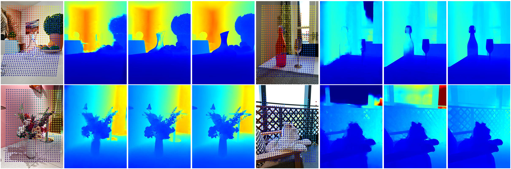

# DEPTHOR (ICCV 2025)

> 📰 This repository contains the official implementation of our paper:  
> **"DEPTHOR: Depth Enhancement from a Practical Light-Weight dToF Sensor and RGB Image"**.

📄 [Paper (arXiv)](https://arxiv.org/abs/2504.01596) | 🌐 [Project Page](https://github.com/ShadowBbBb/Depthor)

<p align="center">
  
</p>

---

## Installation

Set up the environment using conda:

```bash
conda create -n depthor python=3.8
conda activate depthor
pip install -r requirements.txt
```

Install `bpops` from the [BPNet](https://github.com/kakaxi314/BP-Net) (requires **CUDA 12.1**) for CSPN++ support.  
Alternatively, you may use your own CSPN++ implementation and retrain **DEPTHOR** accordingly.

---

## Evaluation

### Step 1: Prepare Dataset  
Download the **ZJU-L5** dataset from [Deltar](https://github.com/zju3dv/deltar), update the **_data_path_eval_** and **_filenames_file_eval_** in 'configs/test_zju.txt', the structure of data directory:

```
└── data
    └── ZJUL5
        ├── data.json
        ├── theater
        │   ├── 1645696174.476698.h5
        │   └── 1645696161.588195.h5
        ├── lab1
        ├── cafe1
        └── cafe2
```

### Step 2: Download Pretrained Models

Place the downloaded checkpoints in the `checkpoints/` directory and update the **_weight_path_** in 'configs/test_zju.txt':

| Model                 | Checkpoint       |
|----------------------|------------------|
| Depthor-ZJU-Large    | [Download](https://drive.google.com/file/d/1oZByVUklbjQHlZTdKFQdwkMKkugi4l6-/view?usp=drive_link)     |
| Depthor-ZJU-Small    | [Download](https://drive.google.com/file/d/1P5I54TZctkilvRMTAzMJHzZs9OdN1fBp/view?usp=drive_link)     |

### Step 3: Run Evaluation

```bash
python evaluate.py configs/test_zju.txt
```

---

## Training

### Step 1: Prepare Dataset
Download the [Hypersim](https://github.com/apple/ml-hypersim) dataset and update the dataset path in 'configs/train_hypersim.txt', the structure of data directory:

```
└── data
    └── evermotion_dataset
        ├── hypersim_train.txt
        ├── hypersim_val.txt
        └── scenes
            ├── ai_001_001
            └── ai_055_010
```
where the `hypersim_train.txt` and `hypersim_val.txt` are provided in 'assets'.
### Step 2: Start Training

```bash
accelerate launch train_acc.py configs/train_hypersim.txt
```

---

## Acknowledgements

This project builds upon the excellent work of the following open-source repositories:

- [Deltar](https://github.com/zju3dv/deltar)
- [BPNet](https://github.com/kakaxi314/BP-Net)
- [Depth-Anything V2](https://github.com/DepthAnything/Depth-Anything-V2)
- [Hypersim](https://github.com/apple/ml-hypersim)

We thank the authors for their contributions to the community.

---

## Citation

If you find this work helpful for your research, please consider citing:

```bibtex
@article{xiang2025depthor,
  title={DEPTHOR: Depth Enhancement from a Practical Light-Weight dToF Sensor and RGB Image},
  author={Xiang, Jijun and Zhu, Xuan and Wang, Xianqi and Wang, Yu and Zhang, Hong and Guo, Fei and Yang, Xin},
  journal={arXiv preprint arXiv:2504.01596},
  year={2025}
}
```
